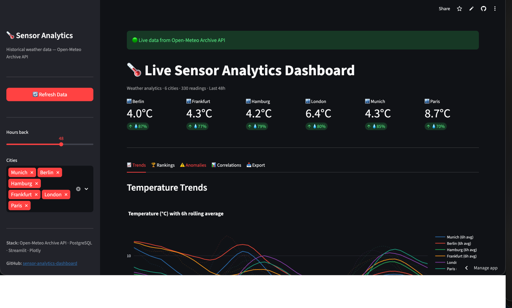
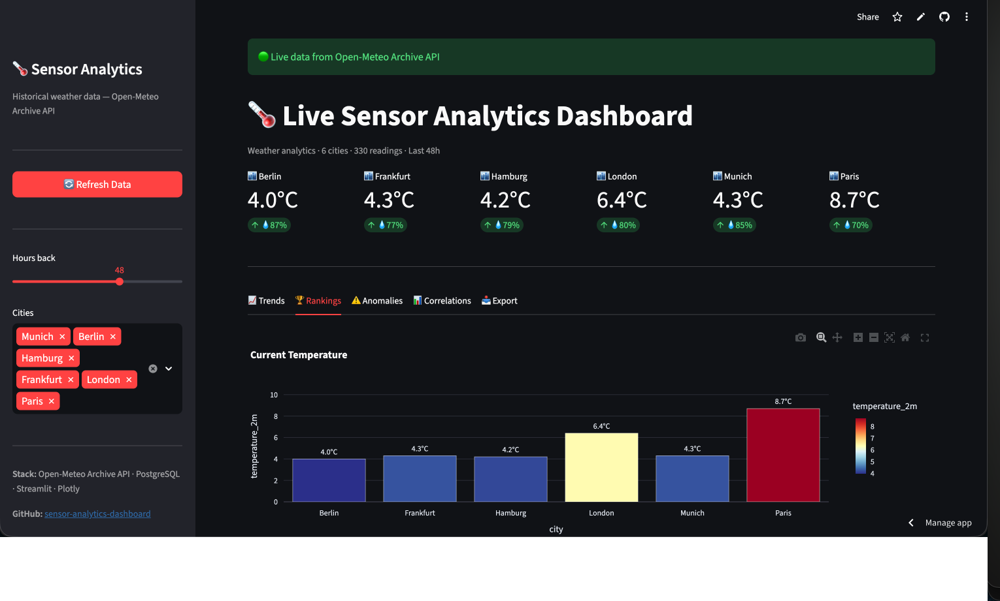
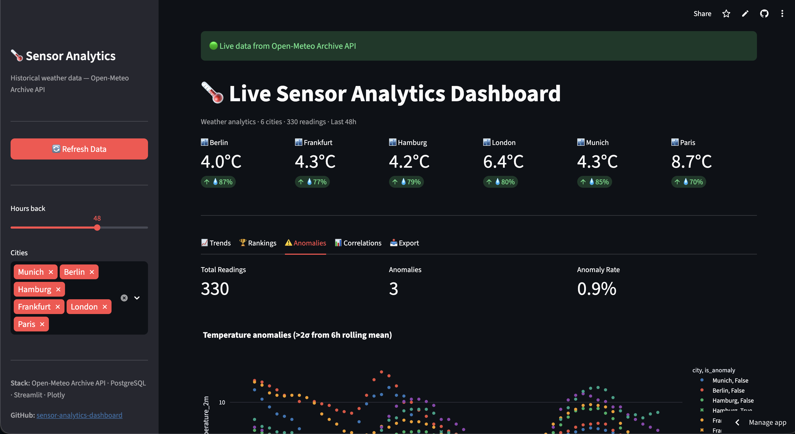
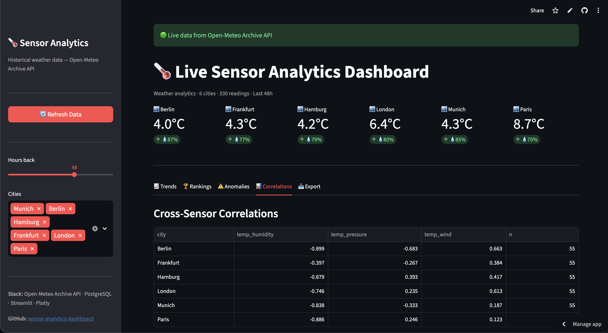
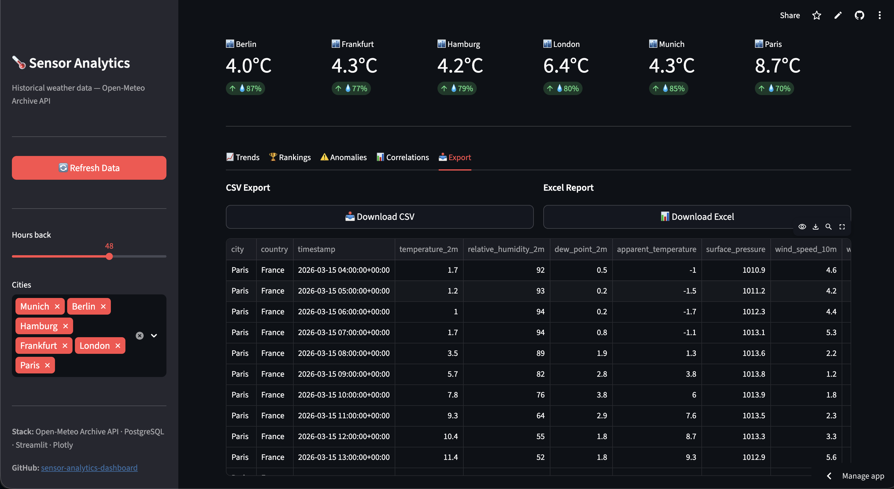

# Live Sensor Analytics Dashboard

**Real-time weather analytics across 6 European cities — Open-Meteo Archive API, PostgreSQL, analytical SQL queries, Streamlit + Plotly, CSV/Excel export**

[](https://python.org/)
[](https://streamlit.io/)
[](https://plotly.com/)
[](https://sensor-analytics-dashboard.streamlit.app/)

---

## Live Demo

**[sensor-analytics-dashboard.streamlit.app](https://sensor-analytics-dashboard.streamlit.app/)**

Real-time weather sensor analytics across Berlin, Frankfurt, Hamburg, London, Munich, and Paris — updated hourly from the Open-Meteo Archive API.

---

## Screenshots

### Trends Tab — Temperature with 6h Rolling Average



### Rankings Tab — City Temperature Comparison



### Anomalies Tab — Statistical Outlier Detection



### Correlations Tab — Cross-Sensor Analysis



### Export Tab — CSV and Excel Download



---

## Overview

A production-grade BI dashboard that ingests live hourly weather sensor data from 6 European cities, stores it in PostgreSQL, runs 10 analytical SQL queries, and presents interactive visualisations across 5 dashboard tabs. Deployed to Streamlit Cloud with a permanent public URL.

---

## Features

**Trends Tab**

* Temperature time series with 6h rolling average overlay per city
* Humidity and atmospheric pressure trends
* Daily summary table (avg/min/max temp, humidity, total precipitation)

**Rankings Tab**

* Current temperature bar chart with colour gradient
* Temperature extremes (min/max overlay)
* Wind speed box plots per city
* Full rankings table with warmth rank

**Anomalies Tab**

* Statistical anomaly detection — readings >2σ from 6h rolling mean
* Anomaly scatter plot with × markers
* Precipitation events table

**Correlations Tab**

* Cross-sensor Pearson correlation table (temp vs humidity, pressure, wind)
* Temperature vs humidity scatter with OLS trendlines per city

**Export Tab**

* CSV download of all sensor readings
* Excel report — Raw / Daily Summary / Rankings sheets

---

## Architecture

```
Open-Meteo Archive API (6 cities × 72h hourly data)
        │
        ▼
┌─────────────────────────┐
│  Python Ingestion        │  fetch_city_archive() — hourly REST calls
│  (requests + pandas)    │  per city, no auth required
└──────────┬──────────────┘
           │
           ▼
┌─────────────────────────┐
│  PostgreSQL              │  Docker container locally
│  (SQLAlchemy ORM)        │  Analytical SQL queries for aggregations
└──────────┬──────────────┘
           │
           ▼
┌─────────────────────────┐
│  Streamlit Dashboard     │  st.cache_data (1h TTL)
│  + Plotly Charts         │  5 tabs, sidebar filters, KPI cards
└──────────┬──────────────┘
           │
           ▼
┌─────────────────────────┐
│  Streamlit Cloud         │  Free permanent URL
│  (live deployment)       │  Auto-redeploys on git push
└─────────────────────────┘
```

---

## Analytical SQL Queries

10 named queries covering:

| Query                       | Description                                                  |
| --------------------------- | ------------------------------------------------------------ |
| `hourly_avg_by_city`      | Hourly avg temperature, humidity, pressure per city          |
| `latest_reading_per_city` | Most recent reading per city (DISTINCT ON)                   |
| `temperature_extremes`    | Min/max/avg/stddev temperature over 72h                      |
| `precipitation_events`    | Readings where precipitation > 0.1mm                         |
| `pressure_anomalies`      | Pressure readings >2 StdDev from city mean (window function) |
| `daily_summary`           | Daily aggregations with total precipitation                  |
| `city_ranking_current`    | RANK() window function on current temperature                |
| `temperature_correlation` | CORR() function across sensor pairs                          |
| `rolling_avg_temp`        | 6h rolling average using window ROWS BETWEEN                 |
| `hourly_wind_speed`       | Hourly avg/max wind speed per city                           |

---

## Data

**330 readings** per refresh across 6 cities:

| City      | Country | Sensors                                                                                        |
| --------- | ------- | ---------------------------------------------------------------------------------------------- |
| Munich    | Germany | temperature, humidity, dew point, apparent temp, pressure, wind speed/direction, precipitation |
| Berlin    | Germany | same                                                                                           |
| Hamburg   | Germany | same                                                                                           |
| Frankfurt | Germany | same                                                                                           |
| London    | UK      | same                                                                                           |
| Paris     | France  | same                                                                                           |

Data refreshed every hour via `st.cache_data(ttl=3600)`. Each refresh fetches 72h of hourly historical data per city from the Open-Meteo Archive API (separate server from forecast API — different rate limits).

---

## Setup

### Local (with PostgreSQL)

```bash
git clone https://github.com/danielamissah/sensor-analytics-dashboard.git
cd sensor-analytics-dashboard
pip install -r requirements.txt

# Start PostgreSQL
docker compose up -d

# Fetch data and start dashboard
make up      # http://localhost:8501
```

### Local (without PostgreSQL — API only)

```bash
pip install -r requirements.txt
streamlit run app.py   # http://localhost:8501
```

The app auto-detects PostgreSQL availability — falls back to API-only mode if DB is unavailable.

---

## Project Structure

```
sensor-analytics-dashboard/
├── app.py                      ← Streamlit dashboard (all-in-one)
├── src/
│   ├── ingestion/fetch_data.py ← Open-Meteo API ingestion
│   ├── queries/analytics.py    ← 10 SQL queries + pandas equivalents
│   └── export/exporter.py      ← CSV + Excel export
├── configs/config.yaml         ← Settings
├── docker-compose.yml          ← PostgreSQL container
├── sample_data.csv             ← Fallback data (432 rows)
├── outputs/figures/            ← Dashboard screenshots
└── requirements.txt
```

---

## Technologies

Open-Meteo Archive API · PostgreSQL · SQLAlchemy · pandas · Streamlit · Plotly · Docker · Python
